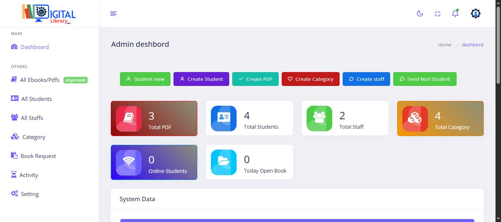
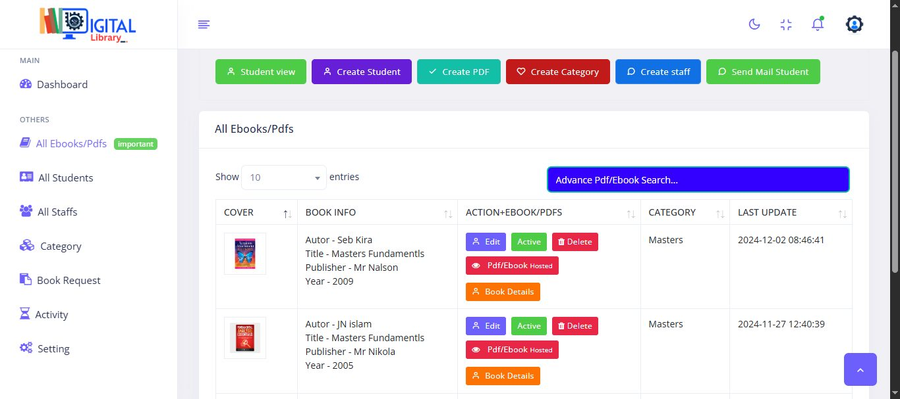
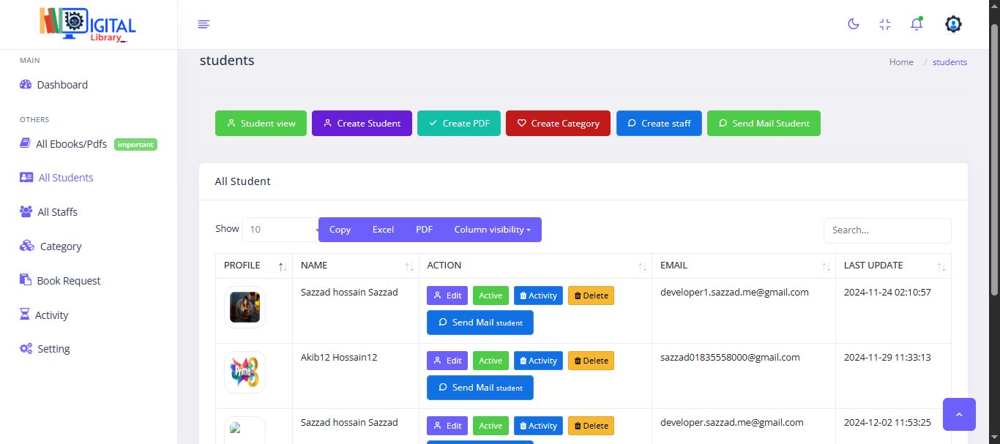
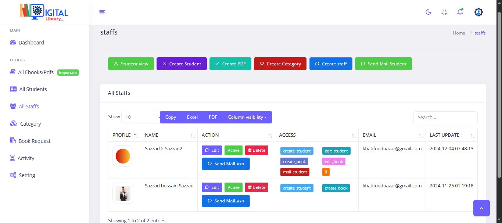
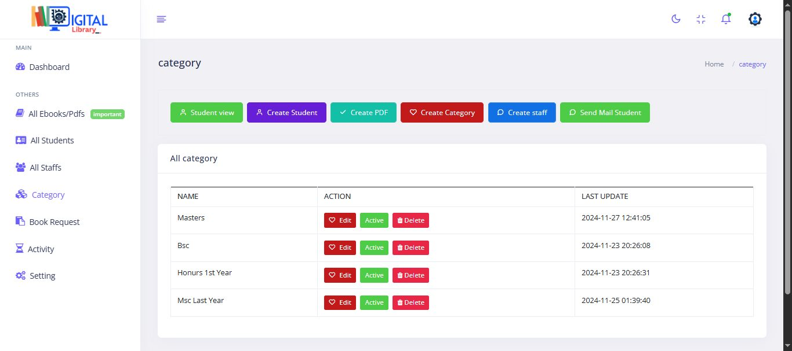
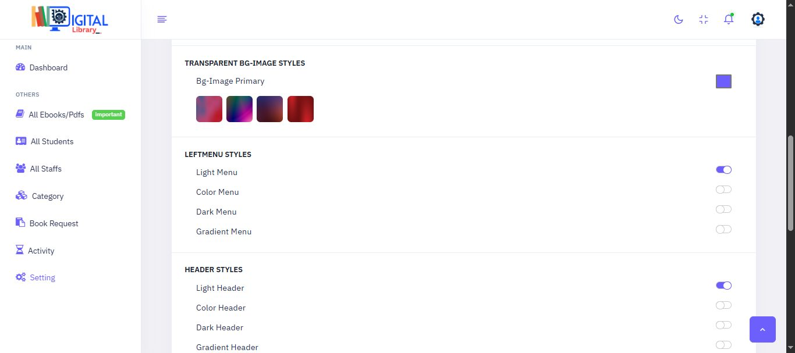
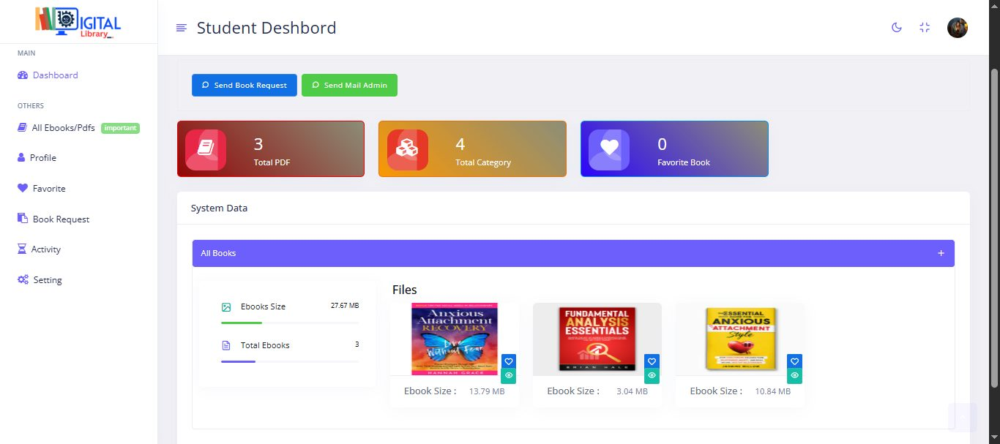
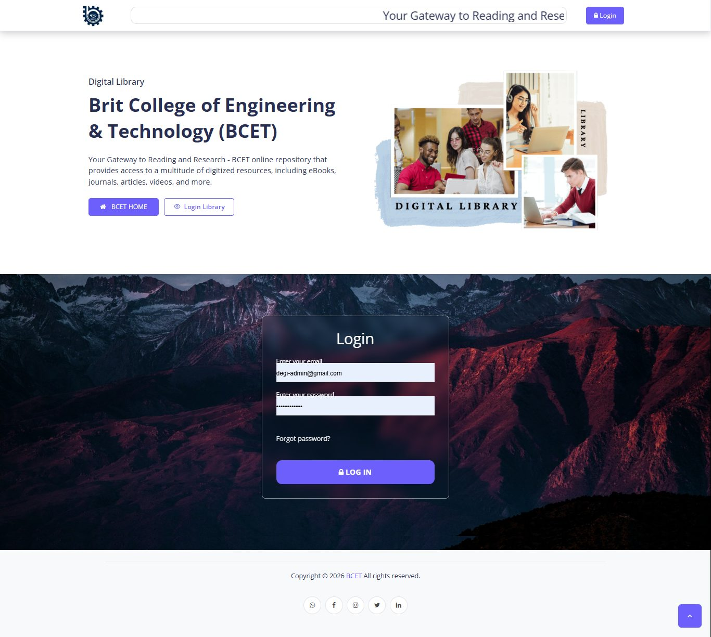
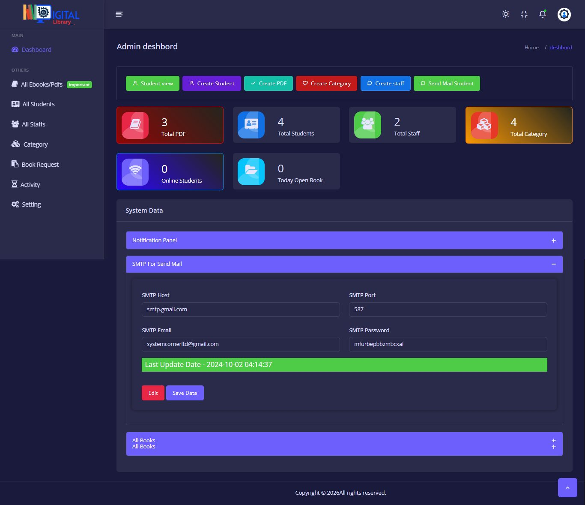

# 📚 Digilibrary — Digital Library & e-Repository Management System

> **A complete digital library platform for Brit College of Engineering & Technology (BCET)** —
> where **admins manage everything**, **staff work with assigned rights**, and **students read online**
> through a beautiful, organised eBook reader — **without any download option**.


---

## 📑 Table of Contents

- [At a Glance](#-at-a-glance)
- [Complete Feature List](#-complete-feature-list)
- [Role System (3 Layers)](#-role-system-3-layers)
- [Screenshots](#-screenshots)
- [Tech Stack](#-tech-stack)
- [Project Structure](#-project-structure)
- [Installation](#-installation)
- [Configuration](#-configuration)
- [Reading Protection & Security](#-reading-protection--security)
- [Roadmap](#-roadmap)
- [License](#-license)
- [Author & Contact](#-author--contact)

---

## ✨ At a Glance

| | |
|---|---|
| ‍💼 **Admin panel** | Full dashboard, books, categories, students, staff, mail, settings |
| 🧑‍ **Staff panel** | Works only with the permission badges the admin assigns |
| ‍🎓 **Student panel** | Read online, favourite books, request books, mail the admin |
| 📖 **Reader** | Clean, organised eBook reading — **streaming only, no download** |
| ⚡ **AJAX everywhere** | Tables, search, mail and settings never reload the page |
| 🔔 **Notification engine** | Login pop-up/banner + "Notify users" email broadcast (SMTP) |
| 🏠 **Dynamic home page** | Admin changes texts, images and social links at runtime |
| 🏷️ **White-label** | No developer credit shown anywhere in the product UI |

---

## ✅ Complete Feature List

### 1. Home Page (Public)

- [x] Simple home page with **Login**
- [x] **Fully dynamic home page** — admin can change text, images and social links from the panel
- [x] **Notification message after login** — appears as a pop-up or visible at the top of the screen

### 2. Three-Layer System

- [x] **a) Admin Panel**
- [x] **b) Staff Panel**
- [x] **c) Student Panel**
- [x] **Student View on Admin** — admin can see exactly what a student sees

### 3. Admin Panel

- [x] **Complete Dashboard** — counters for:
  - Total Books
  - Total Students
  - Total Staff
  - Total Category
  - Online Students
- [x] **Create Category**
- [x] **Create Book** — Book Title, Author, Publisher, Category, Year, Upload **or** Link
- [x] **Book Management System**
- [x] **Staff Management**
- [x] **Students Management** (student data, activity, mail)
- [x] **Admin can send mail to any student**
- [x] **Notify users** — button opens a compose window (Subject + Text message);
      **Send all users** delivers the message to everyone's email via SMTP
- [x] **Admin can Create / Update / Delete all data**

### 4. Books & Search

- [x] **Advance Book Search System**
- [x] **Create Book Type**
  - a) Book Cover + Upload PDF
  - b) PDF Link
- [x] **Beautiful & organised eBook reading system — without download**

### 5. Student Panel

- [x] See books, **read books**, open report, favourite list
- [x] Students can **read all eBooks but cannot download** them
- [x] **Add & view Favourite Book list** (Favorite Added counter on dashboard)
- [x] **Book Request** button — sends *Book Name + Author* to admin
- [x] **Send Mail Admin** button
- [x] **Students Profile** — ID, First Name, Last Name, Profile Pic, Email, Programme Name, Country
- [x] **Students Activity** — report of which student read which book, and when

### 6. Staff Access (set on Admin)

- [x] Create Book
- [x] Create Student
- [x] Create Category

> Staff accounts only see and do what their permission badges allow — toggled live from the
> staff table and re-verified server-side on every request.

### 7. Product Policy

- [x] **No developer credit** displayed in the product UI (white-label delivery)

---

## 🧭 Role System (3 Layers)

```
                ┌───────────────────────────┐
                │        ADMIN PANEL        │  full control + staff rights manager
                └─────────────┬─────────────┘
              assigns badges  │  student view
                ┌─────────────▼─────────────┐
                │        STAFF PANEL        │  create_book / create_student / create_category
                └─────────────┬─────────────┘
                              │ serves
                ┌─────────────▼─────────────┐
                │       STUDENT PANEL       │  read · favourite · request · mail admin
                └───────────────────────────┘
```

---

## 🖼️ Screenshots

| Admin Dashboard | eBook / PDF Manager |
|:---:|:---:|
|  |  |

| Students Management | Staff & Permission Badges |
|:---:|:---:|
|  |  |

| Categories | Theme & SMTP Settings |
|:---:|:---:|
|  |  |

| Student Dashboard | Home Page + Login |
|:---:|:---:|
|  |  |

| Dark Mode Admin + SMTP Panel | |
|:---:|:---:|
|  | |

---

## 🧱 Tech Stack

| Layer | Technology |
|---|---|
| Backend | **PHP 8** — REST-style endpoints with role guards |
| Database | **MySQL** — users, roles_permissions, books, categories, book_requests, favorites, activity_logs, settings |
| Frontend | **HTML / CSS** (mobile-first, themeable) + **Vanilla JavaScript & AJAX** (fetch, DataTables server-side) |
| Cloud | **Firebase** — storage mirror for PDFs/covers + auth token verification |
| Mail | **SMTP** — admin-configurable host/port/app-password; broadcasts & per-user mail |
| Reader | Chunked **HTTP Range** PDF streaming — read without download |

---

## 📁 Project Structure

```
digilibrary/
├── index.php               # dynamic home page + login
├── config/
│   ├── config.php          # DB + Firebase + SMTP credentials
│   └── database.sql        # MySQL schema (8 core tables)
├── admin/                  # admin panel (dashboard, books, staff, students, mail, settings)
├── staff/                  # staff panel (badge-gated)
├── student/                # student panel (reader, favourites, requests, profile)
├── api/                    # AJAX endpoints (stats, books, upload, students, staff_perm,
│                           #   requests, mail, settings, activity, reader/stream)
├── assets/                 # css, js, uploads (covers), social icons
└── reader/                 # streaming reader (Range requests, download disabled)
```

---

## 🚀 Installation

1. **Clone / upload** the project to your PHP host (or XAMPP `htdocs`).
2. **Create the database** and import `config/database.sql`.
3. **Configure** `config/config.php` (see below).
4. **Set writable permissions** on `assets/uploads/` (covers + PDFs).
5. **Login** as admin and change the default password immediately.
6. Configure **SMTP** from *Admin → Settings → SMTP For Send Mail* (host, port, mail, app-password),
   then hit **Save Data** — the green *Last Update Date* bar confirms it.

### Requirements

- PHP ≥ 8.0 (`mysqli`, `curl`, `openssl` extensions)
- MySQL ≥ 5.7 / MariaDB ≥ 10.3
- A Firebase project (Storage + Auth) for the cloud mirror
- An SMTP account (e.g. Gmail app-password, port 587)

---

## ⚙️ Configuration

```php
<?php // config/config.php
return [
    'db' => [
        'host' => 'localhost',
        'name' => 'digilibrary',
        'user' => 'root',
        'pass' => '',
    ],
    'firebase' => [
        'project_id'   => 'your-project',
        'storage_bucket' => 'your-project.appspot.com',
        'service_key'  => __DIR__ . '/firebase-service-account.json',
    ],
    'smtp' => [   // also editable at runtime from Admin → Settings
        'host' => 'smtp.gmail.com',
        'port' => 587,
        'mail' => 'you@gmail.com',
        'pass' => 'your-app-password',
    ],
    'reader' => [
        'allow_download' => false,   // students read only — never download
    ],
];
```

---

## 🔐 Reading Protection & Security

- 📖 PDFs are **streamed in byte ranges** to the in-browser reader; no download endpoint is exposed to students.
- 🛡️ Every AJAX endpoint re-checks **session role + permission badges** server-side.
- 🔒 Passwords hashed (`password_hash`), uploads validated by MIME + size, CSRF-safe posts.
-  Every read / request / login is written to `activity_logs` for the admin's student-activity report.

---

## 🗺️ Roadmap

- [ ] PWA offline shelf for students
- [ ] Reader highlights & notes
- [ ] Native mobile app on the same API
- [ ] Reading analytics dashboard for admin

---

## 📄 License

Released under the **MIT License** — free to use for educational institutions.

---

## 👨‍💻 Author & Contact

**Sazzad Hossain — @developersazzad** · Full-Stack Web Developer

| | |
|---|---|
| 💼 LinkedIn | [linkedin.com/in/developer-sazzad](https://www.linkedin.com/in/developer-sazzad/) |
| 🐙 GitHub | [github.com/developersazzad](https://github.com/developersazzad) |
| 📘 Facebook | [fb.com/developersazzad](https://fb.com/developersazzad) |
| 💬 WhatsApp | [wa.me/8801877856951](https://wa.me/8801877856951) |
| ▶️ YouTube | [youtube.com/@sazzadhossain01](https://www.youtube.com/@sazzadhossain01) |
| 🌐 Portfolio | [sazzad.wedevspro.com](https://sazzad.wedevspro.com/) |

> ⭐ If Digilibrary helps your institution, give the repo a star!
